# 融合多源证据的大语言模型驱动变异测试用例生成

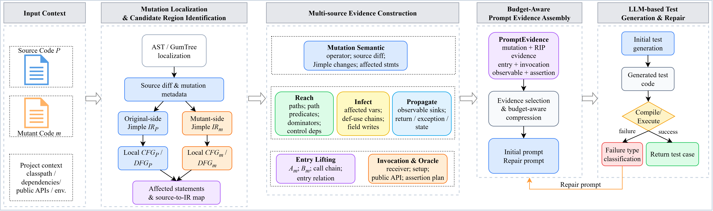

本仓库包含我们关于 **大语言模型驱动变异体杀死单元测试生成** 研究工作的复现实验包。本文提出的方法称为 **RIP-Evidence**。该方法针对每个目标变异体构造多源程序证据，并引导大语言模型生成能够到达变异点、触发状态差异、将差异传播到可观察行为，并能在真实项目环境中成功编译的 JUnit 测试。

不同于覆盖率导向测试生成或仅依赖变异反馈的提示方法，RIP-Evidence 将变异语义、Reach/Infect/Propagate 证据、可调用入口提升、接收者构造、public API 约束、可观察行为、断言计划和编译约束组织为紧凑的 `PromptEvidence` 表示。随后，系统对生成测试进行编译，并根据分类后的编译器反馈进行定向修复，最后在原程序和变异体上执行测试以评估其杀死能力。

---

**_联系方式_**：如果对代码或复现实验包有任何问题，欢迎联系 Lei Hu（hulei172418@gmail.com）。

---

## 1. 概述

本仓库的实验流程以 Excel 为驱动。大多数脚本的 `main` 函数会读取一个变异体元数据 Excel 文件，将每一行解析为目标变异体或评估任务，并据此执行证据构造、LLM 测试生成、编译修复、测试执行和结果收集。

```text
Java 被测项目
  ↓
MuJava 变异体生成
  ↓
变异体元数据 Excel
  ↓
结构化证据构造：graph/output.json
  ↓
PromptEvidence 压缩与后处理
  ↓
基于 LLM 的 JUnit4 测试生成
  ↓
javac 编译与定向修复
  ↓
原程序/变异体执行
  ↓
目标级杀死率与套件级变异得分
  ↓
CSV/JSON 结果汇总
```

本复现实验包包含两个主要代码组件：

```text
evidence/
  为每个变异体构造 graph/output.json。

mutest/
  在 MuJava 基础上扩展 LLM 测试生成、编译修复、
  变异体执行和实验结果收集功能。
```

原始 MuJava 变异测试系统作为底层变异测试后端使用。其原始项目主页为：

```text
https://www.albany.edu/faculty/offutt/mujava/
```

本仓库在 MuJava 基础上扩展了 Excel 驱动的任务管理、RIP 引导的证据抽取、LLM 测试生成和大规模实验统计能力。

---

## 2. 运行环境

我们的实验使用如下环境。

- 平台：兼容 Windows/Linux；大规模实验通过 Maven 风格 classpath 管理 Java 项目依赖。
- Java：建议使用 JDK 8，以保证 MuJava 与 JUnit4 兼容。
- 构建系统：建议使用 Maven 解析项目依赖。
- 单元测试框架：JUnit 4.12 + Hamcrest。
- 静态分析工具：Soot、JavaParser、GumTree。
- 数据处理工具：Apache POI、Jackson。
- 可选可视化工具：Graphviz。
- 大模型访问方式：OpenAI-compatible Chat Completion API。
- 基线工具：Randoop 和 EvoSuite 仅用于对比实验。

项目还使用以下配置文件：

```text
mujava.config
mujavaCLI.config
libraries.json
llm.properties
```

`mujava.config` 定义 MuJava 路径、被测项目路径、结果目录、class 目录和 Maven 仓库路径。  
`libraries.json` 记录项目相关依赖。  
`llm.properties` 配置 LLM provider、模型名称、API URL、API key、运行预算和修复设置。

---

## 3. 数据集

### (1) 被测项目与变异体

我们在 12 个 Java 项目上评估 RIP-Evidence，其中包括 11 个开源 Java 项目和 1 个基准程序集合。数据集共包含 125,157 个生成变异体。过滤等价变异体后，使用 106,130 个非等价变异体作为测试生成目标。

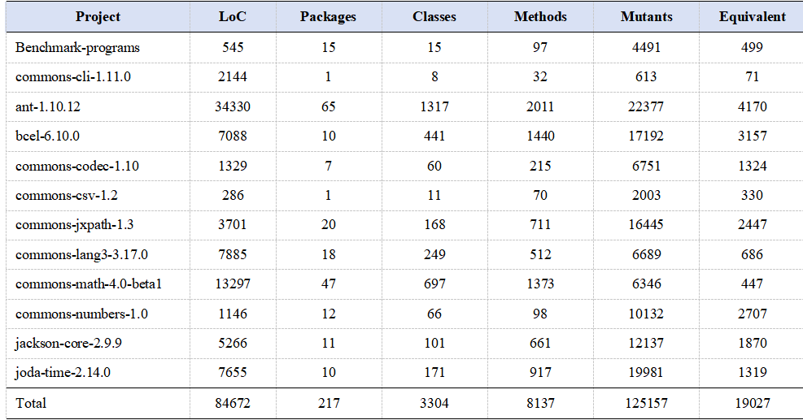

**表 2** 汇总了被测项目的信息，包括代码行数、包数、类数、方法数、生成变异体数和等价变异体数。

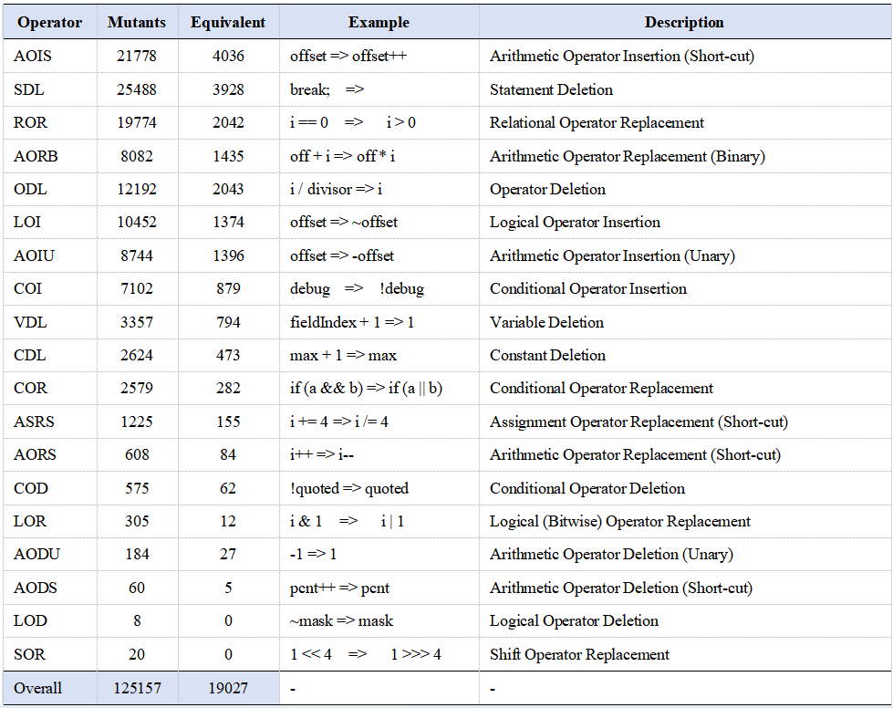

**表 3** 汇总了本文使用的 19 类传统变异算子。这些算子覆盖算术、逻辑、条件、关系、变量级和语句级变异。

### (2) 变异体元数据 Excel

大多数脚本由变异体元数据 Excel 文件驱动。该 Excel 文件是连接变异体、源码路径、生成证据、生成测试和执行报告的中心索引。

典型 Excel 文件包含以下字段：

| 列号 | 字段 | 含义 |
|---:|---|---|
| 0 | `operator` / `mutantName` | 变异体名称，例如 `AOIS_1` |
| 1 | `lineNo` | 变异所在源码行 |
| 2 | `methodSignature` | 目标方法签名 |
| 3 | `className` | 目标类名 |
| 4 | `classNameF` | 源文件类名 |
| 5 | `mutationStatement` | 变异语句或源码级差异 |
| 6 | `packageName` / `targetClassName` | 包名或 MuJava 目标类 |
| 7 | `projectName` | 被测项目名称 |
| 8 | `file_path` | 变异体文件路径或结果模块路径 |
| 9 | `original_graph_path` | 原程序侧源码或 graph 路径 |
| 10 | `mutant_graph_path` | 变异体侧源码或 graph 路径 |
| 11 | `is_killed` | 可选历史标签或参考结果 |

主要唯一标识键为：

```text
projectName + targetClassName + methodSignature + mutantName
```

该键在证据生成、LLM 测试生成、测试执行、结果合并和产物检查中保持一致。

### (3) 数据集获取方式

预处理后的数据集和实验元数据将单独发布。运行实验前，请将 Excel 元数据文件和被测项目放置到 `mujava.config` 指定的路径下。

---

## 4. 方法与实现

### (1) 多源程序证据

对于每个目标变异体，RIP-Evidence 从原程序、变异体和项目上下文中构造结构化证据。

证据包括：

| 证据类型 | 作用 |
|---|---|
| 变异语义证据 | 定位变异语义锚点并描述发生了什么变化 |
| Reach 证据 | 帮助生成能够到达变异点的输入和调用 |
| Infect 证据 | 说明变异是否可能引入内部状态差异 |
| Propagate 证据 | 跟踪差异是否会影响返回值、异常、对象状态或外部行为 |
| 入口提升证据 | 区分真实变异方法和测试可调用入口 |
| 调用构造证据 | 提供 receiver 构造、setup 模板、调用模板和示例参数 |
| API 约束证据 | 避免 API 幻觉和调用不可用方法 |
| 断言约束证据 | 指导生成变异敏感断言并避免弱断言 |
| 类型与依赖证据 | 减少类型错误、缺失 import 和未处理异常 |
| Skip-Signal 证据 | 当缺少合法入口或可观察行为时避免无效 LLM 调用 |

### (2) 真实变异方法 A 与测试可调用入口 B

一个关键实现特征是区分：

```text
A = 真实变异方法
B = 测试可调用入口
```

方法 A 包含变异点，用于构造变异侧 RIP/CFG/DFG 证据。  
方法 B 是生成的 JUnit 测试应该调用的方法。如果 A 是 private、protected、package-private、abstract，或只能通过其他方法间接触达，工具链会搜索一个可调用入口 B，并记录 B→A 调用链。

该设计能够减少非法调用、不可访问方法调用，以及无法触达变异点的测试。

### (3) PromptEvidence

完整 `output.json` 可能过大，无法直接放入提示。因此，RIP-Evidence 会将其压缩为 `PromptEvidence`。

主要部分包括：

```text
mutation
entry
executableTestPlan
invocation
assertions
mutationEvidence
mutationGraphEvidence
entryEvidence
entryGraphEvidence
publicApiEvidence
observablePlan
```

预算感知压缩器优先保留变异语义、可调用入口、调用计划、receiver 构造、public API 约束、可观察行为、断言计划和关键 RIP 摘要。重复路径、较长 Jimple 片段、低相关 API 和重复图证据会被优先裁剪。

### (4) LLM 生成与编译修复

LLM 生成流程如下：

```text
读取 output.json
  ↓
构造 PromptEvidence
  ↓
构造初始生成 prompt
  ↓
调用 LLM
  ↓
抽取 Java 测试代码
  ↓
使用 javac 编译
  ↓
如果编译失败：
    分类 javac 错误
    构造定向修复 prompt
    再次调用 LLM
  ↓
输出已编译 JUnit 测试或失败报告
```

编译器错误被分类为缺失 import、构造函数不匹配、方法不存在、private 访问、抽象类实例化、测试桩不完整、非法 override、void 返回值误用、编造 API、输出截断和空 LLM 输出等类型。随后，修复 prompt 会根据错误类型进行专门化。

---

## 5. 仓库结构

推荐的仓库结构如下。

```text
RIP-Evidence/
├── evidence/
│   ├── src/
│   ├── README.md
│   └── scripts/
│
├── mutest/
│   ├── src/
│   ├── README.md
│   ├── mujava.config
│   ├── mujavaCLI.config
│   ├── libraries.json
│   └── llm.properties.example
│
├── data/
│   ├── mutant_metadata_example.xlsx
│   └── README.md
│
├── figs/
│   ├── Fig2.png
│   ├── Fig4.png
│   ├── Fig5.png
│   ├── Fig6.png
│   ├── Table2.png
│   ├── Table3.png
│   ├── Table4.png
│   ├── Table5.png
│   └── ...
│
└── README.md
```

---

## 6. 实验复现

请按照第 2 节配置运行环境，并配置 `mujava.config`、`libraries.json` 和 `llm.properties`。

### Step 1. 生成 MuJava 变异体

使用 MuJava 变异体生成入口生成传统方法级变异体。

```bash
java -cp <classpath> mujava.cmd.MutantsGenerator <args>
```

或使用 CLI 包装入口：

```bash
java -cp <classpath> mujava.TraditionalMutantsGeneratorCLI <args>
```

预期输出：

```text
<project>/result/<targetClassName>/traditional_mutants/
```

变异体生成完成后，导出或构造变异体元数据 Excel 文件。

---

### Step 2. 生成结构化 `output.json` 证据

使用 Excel 文件运行证据生成工具。

```bash
java -Xmx16g -cp <classpath> org.OutputJsonBatchRunner \
  --excel <mutant_metadata.xlsx> \
  --mode process \
  --workers 8 \
  --rewrite true \
  --rowStart 1 \
  --rowEnd -1
```

调试小范围样本时可使用：

```bash
java -Xmx16g -cp <classpath> org.OutputJsonBatchRunner \
  --excel <mutant_metadata.xlsx> \
  --mode single \
  --rewrite true \
  --rowStart 1 \
  --rowEnd 100
```

预期输出：

```text
<mutantDir>/graph/output.json
```

批处理日志：

```text
logs/output_json_parallel/<excel-name>_<timestamp>/
├── summary.tsv
├── output_json_batch.log
├── pids.txt
└── STOP
```

---

### Step 3. 生成并编译 LLM 测试

在 `mutest` 中运行 LLM 测试生成入口。

```bash
java -Xmx16g \
  -Dpath.to.mujava.config=<mujava.config> \
  -Dllm.provider=deepseek \
  -Dllm.threads=4 \
  -Dllm.force.regenerate=false \
  -cp <classpath> \
  mujava.testgenerator.LLMTestGeneratorBatch <mutant_metadata.xlsx>
```

部分本地版本会在 `main` 函数内部直接指定 Excel 路径。为了公开复现，建议通过命令行参数或 JVM property 传入 Excel 文件。

预期输出：

```text
<resultModuleHome>/llm/
├── src/
├── classes/
└── report/
    ├── llm_generation_results.jsonl
    ├── <TestName>__compact_evidence.json
    ├── <TestName>__prompt.txt
    ├── <TestName>__response_0.json
    ├── <TestName>__compile_error_0.txt
    ├── <TestName>__repair_1_prompt.txt
    └── <TestName>__generation_summary.txt
```

---

### Step 4. 在变异体上执行生成测试

运行 LLM 测试执行器。

```bash
java -Xmx16g -cp <classpath> mujava.testgenerator.LLMTestExecutor \
  <mutant_metadata.xlsx> \
  5000
```

参数含义：

```text
arg0 = Excel 元数据文件
arg1 = 超时时间，单位毫秒
```

常用 JVM 参数：

```bash
-Dllm.executor.granularity=method
-Dllm.executor.quickPrimaryOnly=false
-Dllm.executor.startRow=1
-Dllm.executor.endRow=10000
```

预期输出：

```text
<resultModuleHome>/llm/execution-report/<runId>/
├── llm_target_kill_results.json
├── llm_target_kill_results.csv
├── llm_suite_kill_results.json
├── all_method_summary.csv
├── all_method_summary.json
├── all_class_summary.csv
└── llm_execution_summary.txt
```

---

### Step 5. 合并 LLM 杀死结果

```bash
java -Xmx16g -cp <classpath> mujava.testgenerator.LlmMutantKillDetailCollector \
  <ProgramsRoot> \
  <mutant_metadata.xlsx> \
  <output_csv>
```

示例：

```bash
java -Xmx16g -cp <classpath> mujava.testgenerator.LlmMutantKillDetailCollector \
  E:/PHD/testJava/Programs \
  E:/PHD/testJava/MutantParse/data/mutant_statistic_total_graph_llm.xlsx \
  E:/PHD/testJava/MutantParse/data/llm_mutant_kill_detail_merged.csv
```

预期输出：

```text
llm_mutant_kill_detail_merged.csv
```

---

### Step 6. 可选：运行对比基线

Randoop 和 EvoSuite 仅作为对比基线使用，不属于 RIP-Evidence 方法本身。

EvoSuite 相关命令如下：

```bash
java -Xmx16g -cp <classpath> mujava.testgenerator.EvoSuiteTestGenerator
java -Xmx16g -cp <classpath> mujava.testgenerator.EvoSuiteCleaner
java -Xmx16g -cp <classpath> mujava.testgenerator.EvoSuiteMutantKillDetailCollector \
  <ProgramsRoot> \
  <mutant_metadata.xlsx> \
  <output_csv>
```

预期输出：

```text
evosuite_mutant_kill_detail_merged.csv
```

---

### Step 7. 可选：产物检查与失败诊断

统计生成产物：

```bash
java -Xmx16g -cp <classpath> mujava.testgenerator.LlmArtifactTableCounter \
  <mutant_metadata.xlsx>
```

导出 `compiled=false` 记录：

```bash
java -Xmx16g -cp <classpath> mujava.testgenerator.JsonlCompiledFalseToExcel
```

导出缺失 `.class` 文件的行：

```bash
java -Xmx16g -cp <classpath> mujava.testgenerator.MissingCompiledClassExcelExporter \
  <mutant_metadata.xlsx> \
  missing_llm_class_rows.xlsx
```

收集分组失败证据：

```bash
java -Xmx16g -cp <classpath> mujava.testgenerator.MissingFailureEvidenceCollector \
  missing_llm_class_rows.xlsx \
  grouped_minimal_failure_evidence_for_llm.json
```

从历史记录恢复已编译测试，避免再次调用 LLM：

```bash
java -Xmx16g -cp <classpath> mujava.testgenerator.LLMCompiledTestRestorer \
  <mutant_metadata.xlsx>
```

---

## 7. 实验结果与分析

### 1）RIP-Evidence 在项目层面上的效果如何？

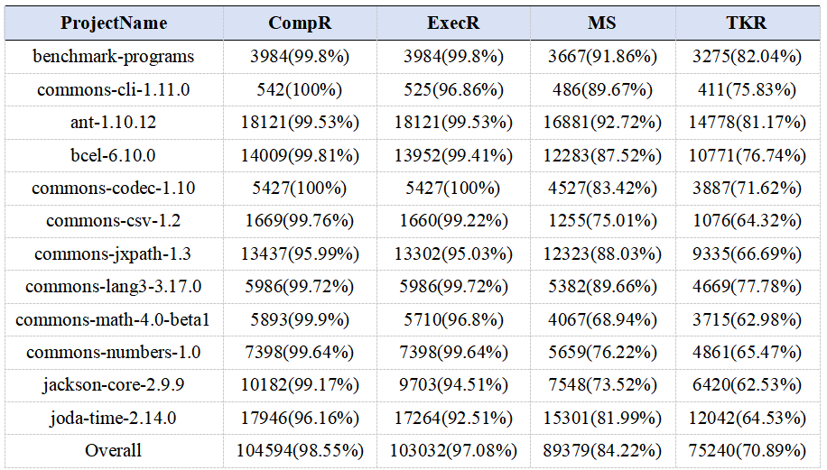

**表 4** 报告了 RIP-Evidence 的项目级测试生成结果。总体上，RIP-Evidence 的编译成功率为 98.55%，执行成功率为 97.08%，套件级变异得分为 84.22%，目标变异体杀死率为 70.89%。

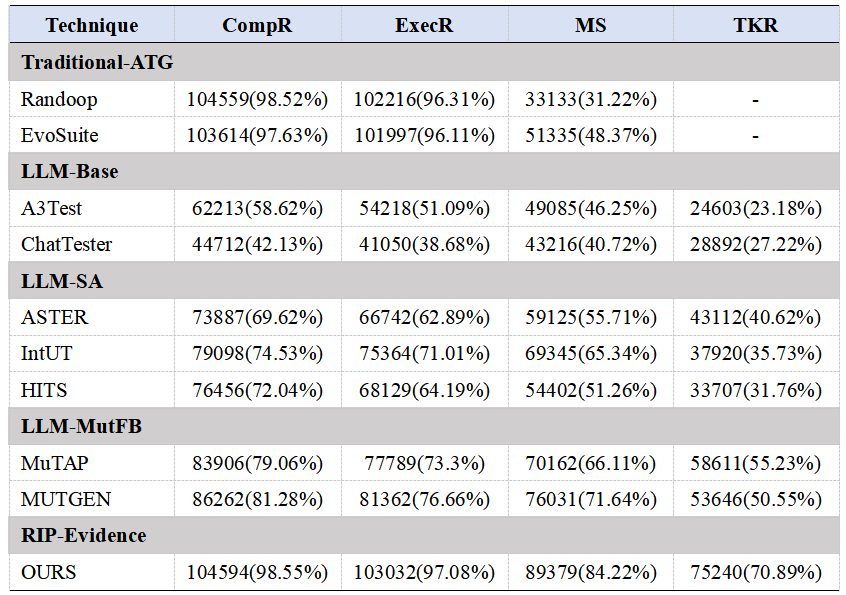

**表 5** 将 RIP-Evidence 与传统自动测试生成、基础 LLM 测试生成、静态分析增强 LLM 测试生成和变异反馈增强 LLM 测试生成进行了比较。RIP-Evidence 在 CompR、ExecR、MS 和 TKR 上均优于可比较的 LLM-based 基线。

---

### 2）在不同变异算子上的杀死能力是否稳定？

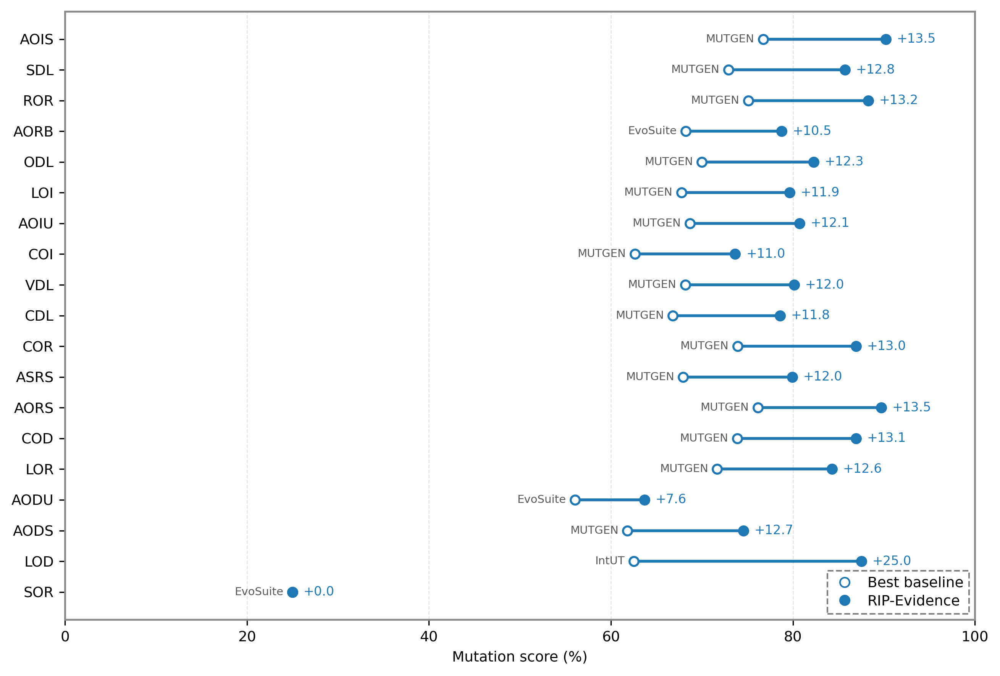

**图 4** 比较了 RIP-Evidence 与最优基线在不同变异算子上的变异得分。RIP-Evidence 在 19 个变异算子中的 18 个上超过最优基线，并在剩余一个算子上持平。

---

### 3）效率和修复成本如何？

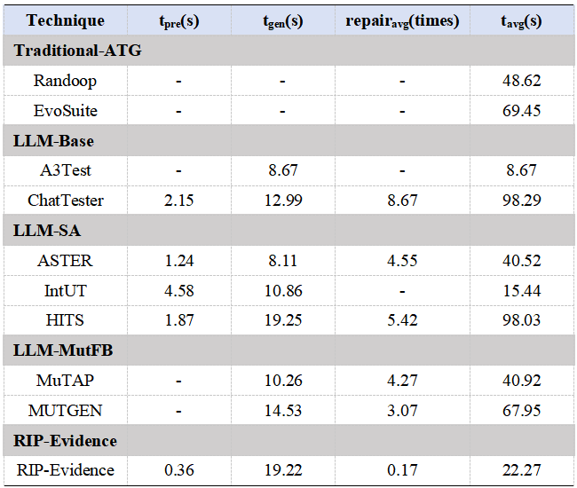

**表 6** 报告了时间开销和编译修复成本。RIP-Evidence 的平均生成成本低于所有 LLM-based 基线。其证据构造和 PromptEvidence 组织开销较小，同时平均修复轮数显著减少。

---

### 4）RIP-Evidence 是否适用于不同 LLM backbone？

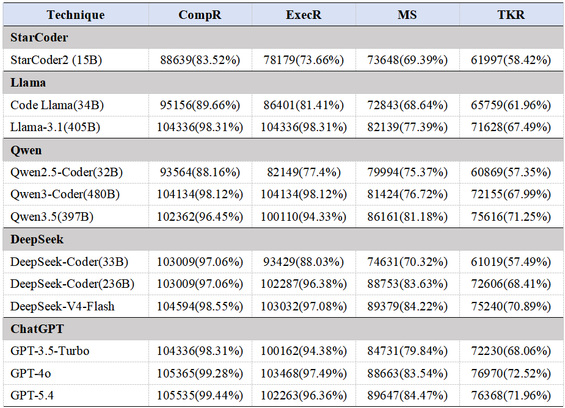

**表 7** 表明 RIP-Evidence 在不同 LLM backbone 下仍然有效，包括 StarCoder、Code Llama、Qwen、DeepSeek 和 ChatGPT 系列模型。

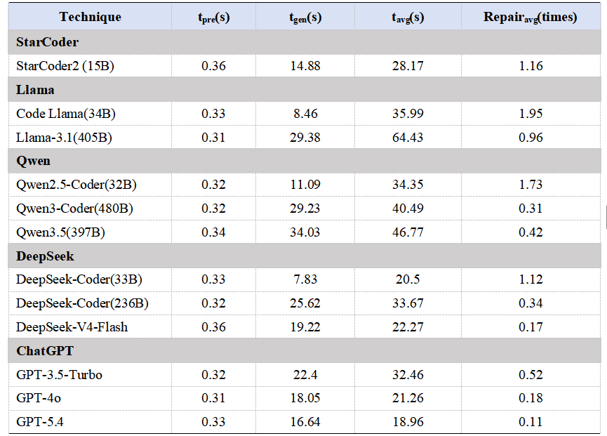

**表 8** 报告了不同 LLM backbone 下的效率和修复开销。通常，能力更强的模型需要更少的修复轮数，而证据构造和 PromptEvidence 组织时间基本稳定。

---

## 8. 讨论

### 1）多源证据的整体贡献

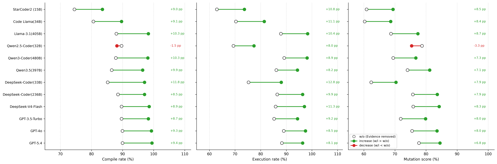

**图 5** 比较了加入和移除多源证据时的 LLM 测试生成结果。结果表明，结构化证据能够在多数模型上提升编译率、执行率和变异得分。

---

### 2）证据组件贡献

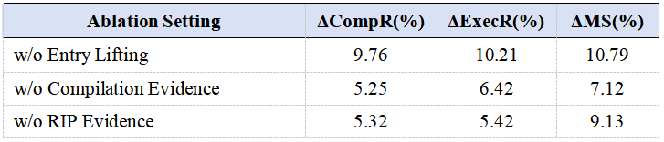

**表 9** 报告了主要证据组件的消融结果。移除入口提升、编译证据或 RIP 证据都会导致明显性能下降。

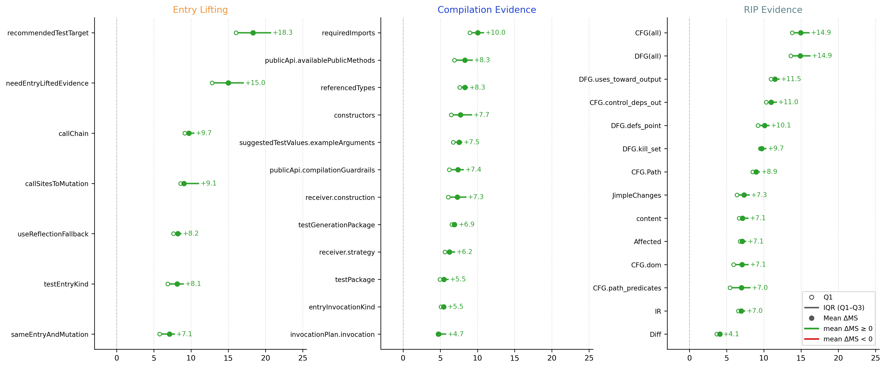

**图 6** 展示了不同证据字段对变异得分的细粒度影响，突出体现了可调用入口、public API 约束和 CFG/DFG 证据的作用。

---

### 3）Token 预算与证据压缩

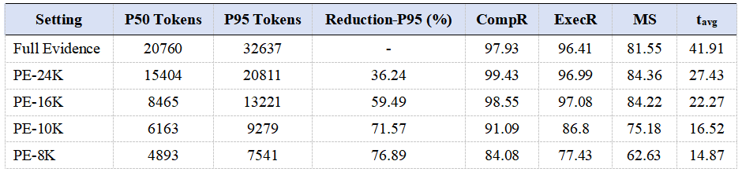

**表 10** 报告了不同 PromptEvidence 预算的影响。PE-16K 在测试有效性和生成成本之间取得了较好的平衡。

---

### 4）失败模式

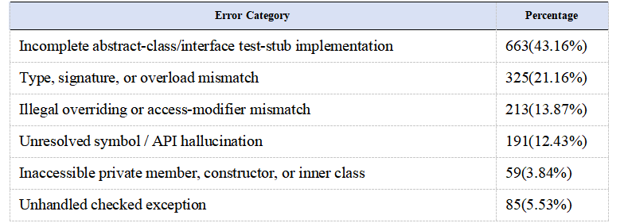

**表 11** 对测试生成失败案例进行了分类。剩余失败主要与抽象类/接口测试桩不完整、类型或签名不匹配、非法 override、未解析符号、private 访问和未处理 checked exception 有关。

---

## 9. 实现与代码可用性

主要实现组件包括：

1. **结构化证据构造。**  
   将源码级变异差异映射到 IR 级 CFG/DFG/RIP 证据，解析可调用测试入口，构造依赖上下文，并写出 `graph/output.json`。

2. **PromptEvidence 构造与 LLM 测试生成。**  
   将 `output.json` 压缩为紧凑证据，构造提示，调用 OpenAI-compatible LLM，抽取生成的 Java 测试，编译测试，并进行定向修复。

3. **基于 MuJava 的变异体执行与结果收集。**  
   在 MuJava 执行基础上扩展多进程隔离、目标级杀死评估、套件级变异得分计算和 CSV/JSON 结果收集。

4. **基线与分析脚本。**  
   包括可选基线执行以及产物/失败分析工具。

---

## 10. 主要输出

以下文件通常用于论文级统计：

```text
# Evidence
<mutantDir>/graph/output.json

# LLM generation
<resultModuleHome>/llm/report/llm_generation_results.jsonl
<resultModuleHome>/llm/src/
<resultModuleHome>/llm/classes/

# Execution
<resultModuleHome>/llm/execution-report/<runId>/llm_target_kill_results.csv
<resultModuleHome>/llm/execution-report/<runId>/llm_suite_kill_results.json
<resultModuleHome>/llm/execution-report/<runId>/all_method_summary.csv
<resultModuleHome>/llm/execution-report/<runId>/all_class_summary.csv

# Merged statistics
llm_mutant_kill_detail_merged.csv
evosuite_mutant_kill_detail_merged.csv
llm_artifact_statistics.csv
compiled_false.xlsx
missing_llm_class_rows.xlsx
grouped_minimal_failure_evidence_for_llm.json
```

---

## 11. 指标

我们报告四个主要有效性指标。

| 指标 | 含义 |
|---|---|
| CompR | 生成测试成功编译的目标变异体比例 |
| ExecR | 生成测试能够在原程序上成功执行并获得可比较结果的目标变异体比例 |
| MS | 基于非等价目标变异体的套件级变异得分 |
| TKR | 目标变异体杀死率，即每个生成测试是否杀死其对应目标变异体 |

此外，我们还报告：

| 指标 | 含义 |
|---|---|
| `tEvidenceConstruct` | 证据构造时间 |
| `tPromptEvidence` | PromptEvidence 组织时间 |
| `tGeneration` | LLM 生成时间 |
| `tavg` | 每个目标变异体的平均处理时间 |
| `Repairavg` | 平均编译修复轮数 |

需要注意，MS 和 TKR 衡量不同方面。MS 衡量生成测试套件的整体变异体杀死能力，而 TKR 衡量一对一目标变异体杀死能力。

---

## 12. 注意事项

- 原始 MuJava 系统保留为变异测试后端。
- 本文方法以 `output.json`、`PromptEvidence` 和证据引导生成流程为核心。
- Excel 文件是证据构造、测试生成、测试执行和结果合并的中心索引。
- EvoSuite 和 Randoop 是对比基线，不属于 RIP-Evidence 流水线本身。
- 大规模实验建议使用 process 模式进行证据构造，并使用多进程执行进行变异体评估。
- 调试单个样本时，建议检查 `compact_evidence.json`、prompt 文件、LLM response 文件、compiler error 文件和 generation summary。

---

## 13. 引用

如果使用本仓库，请引用我们的论文和原始 MuJava 工作。

```bibtex
@article{rip_evidence_llm_mutation_test_generation,
  title   = {Multi-Source Evidence-Guided Large Language Models for Mutation Unit Test Generation},
  author  = {Hu, Lei and Yao, Xiangjuan and Wei, Changqing},
  journal = {Under Review},
  year    = {2026}
}
```

原始 MuJava：

```bibtex
@inproceedings{ma2006mujava,
  title     = {MuJava: A mutation system for Java},
  author    = {Ma, Yu-Seung and Offutt, Jeff and Kwon, Yong-Rae},
  booktitle = {Proceedings of the 28th International Conference on Software Engineering},
  pages     = {827--830},
  year      = {2006}
}
```
